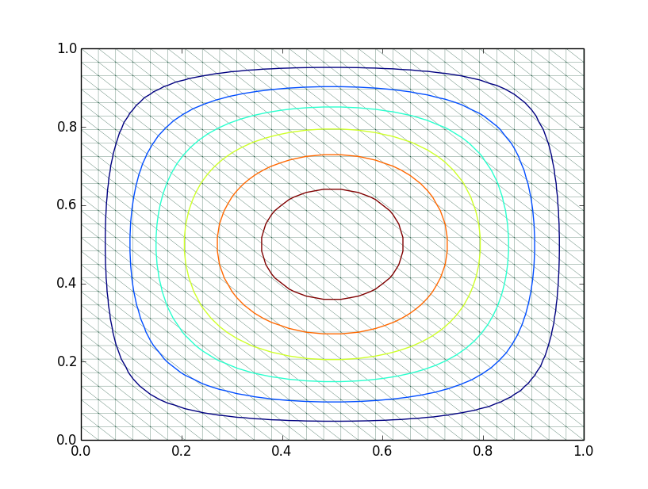

This code is a rewriting of the matlab code from "Remarks around 50 lines of Matlab: short finite element implementation"

http://link.springer.com/article/10.1023/A:1019155918070

https://www.math.hu-berlin.de/~cc/cc_homepage/download/1999-AJ_CC_FS-50_Lines_of_Matlab.pdf

in the julia language. For the matlab version, see

https://github.com/cpraveen/fem50

## TODO
Add plotting solution for quadrilaterals. The matlab code uses trisurf which can plot triangles and quadrilaterals. There is no equivalent function I could find in PyPlot. I use contour plots in the Julia code through the tricontour function from PyPlot. If you run the example in "sample", it plots quadrilaterals by triangulating them.

## How to run example in "square"
You need to install the PyPlot package to plot results.
```
import Pkg
Pkg.add("PyPlot")
```
First, generate the mesh
```
bash> cd square
```
Generate mesh by running square.m in matlab (julia version not completed)
```
matlab> square(30)
matlab> quit
```
Run the fem code
```
bash> julia run.jl
```
You should get a solution like this



## Constructing sparse matrix
The simplest way to initialize an empty nxn sparse matrix is
```
julia> A = spzeros(n,n)
```
This makes use of 64 byte integers and floats. For small problem sizes, 32 byte integers are enough for indexing, in which case you can do
```
julia> A = sparse(Int32[], Int32[], Float64[], n, n)
```

## Feedback
This was my first attempt at writing a Julia program. Comments, feedback or criticism to improve this code is most welcome. Please email me at My_Github_Username@gmail.com
